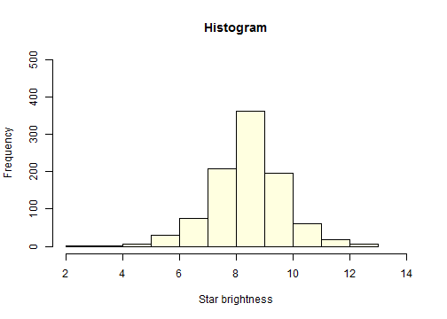

## ui.R

### sideBarPanel
1. Guess the mean brightness: User input via the slider bar
2. The app return and display the user input
3. The app calculate and return the Mean Squared Error (MSE) of the user input
4. The app return whether the user makes a good guess or makes another try.

### mainBarPanel
1. Display the histogram

--- .class #id

## ui.R


```r
library(shiny)
shinyUI(pageWithSidebar(
      headerPanel("966 stars"),
      sidebarPanel(
            sliderInput('mu','Guess the mean brightness', value = 5.00, min = 2.00, max = 14.00, 
                        step = 0.01),
            h6('You guessed a mean brightness of'),
            verbatimTextOutput('mu'),
            h6('The Mean Squared Error (MSE) is'),
            verbatimTextOutput('mse'),
            h5('Outcome:'),
            verbatimTextOutput('accuracy')          
      ),
      mainPanel(
            plotOutput('newHist')           
      )
))
```


--- .class #id 

## server.R


```r
library(UsingR)
data(brightness)
hist(brightness, xlab='Star brightness', breaks = 12, freq = TRUE, xlim = c(2,14), ylim = c(0, 500), 
     col='lightyellow', main='Histogram')
```




---
      
## Summary
      
1. server.R will calculate the Mean Squared Error (MSE) based on user input and return MSE to ui.R
2. Visit the app at https://simplzmarvel.shinyapps.io/9CourseProject/  
      
You may leave me a note for feedback and improvements. Thank you. 

---
